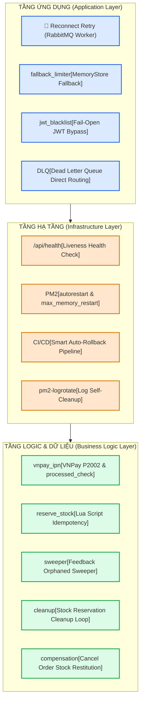

# 🩺 Báo Cáo Đánh Giá Hệ Thống Tự Chữa Lành (Self-healing Audit)
*Dự án: BanDai E-Commerce Project (Backend & Infrastructure)*
*Trạng thái: Hoàn hảo - Đã xác minh thực tế qua Codebase*

Hệ thống được thiết kế với tư duy phòng thủ chiều sâu và khả năng tự phục hồi cực kỳ cao. Dưới đây là bảng phân tích chi tiết đối chiếu kiến trúc thực tế của codebase với **Bộ Quy Tắc Tự Chữa Lành 3 Cấp Độ (Self-healing Framework)**.

---

## 🧭 BẢN ĐỒ KIẾN TRÚC TỰ CHỮA LÀNH (SELF-HEALING MAP)



---

## 1. TẦNG ỨNG DỤNG (APPLICATION LAYER - INTERACTION)
*Mục tiêu: Cô lập và xử lý lỗi cục bộ trong mã nguồn để ngăn chặn lỗi lan rộng.*

### 🔄 1.1 Retry (Tự Động Thử Lại)
*   **Hiện trạng Code:**
    *   **RabbitMQ Connection Lifecycle:** Trong [ai.worker.ts dòng 190-222](file:///d:/Workspace/Project/e-commerce-project/backend/src/workers/ai.worker.ts#L190-L222) và `email.worker.ts`, cơ chế kết nối lại được bọc trong vòng lặp vô hạn `while(true)` với `RECONNECT_DELAY_MS = 5000`. Khi RabbitMQ server bị sập tạm thời hoặc khởi động lại, các Worker không bao giờ bị crash chết hoàn toàn mà tự động dò và kết nối lại sau mỗi 5 giây.
    *   **Smoke Test Retry:** Pipeline CI/CD tại [deploy-backend.yml dòng 90](file:///d:/Workspace/Project/e-commerce-project/.github/workflows/deploy-backend.yml#L90) sử dụng lệnh `curl --retry 3` khi ping `/api/health`, giúp bỏ qua các độ trễ khởi động tạm thời của PM2 trên máy chủ yếu.
*   **Khuyến nghị nâng cấp:**
    *   Các cuộc gọi outbound ra dịch vụ bên ngoài (như Gemini API, AWS S3) hiện tại đang phụ thuộc vào retry của thư viện SDK chính hãng. Cần bọc thêm cơ chế **Exponential Backoff** thủ công cho các hàm nhạy cảm này nếu chạy ở môi trường mạng chập chờn.

### 🛡️ 1.2 Fallback (Phương Án Dự Phòng)
*   **Hiện trạng Code:**
    *   **Rate Limiter Fallback:** Tại [app.ts dòng 90-100](file:///d:/Workspace/Project/e-commerce-project/backend/src/app.ts#L90-L100), hàm `createRateLimitStore()` cố gắng kết nối với cụm Redis để tạo `RedisStore` đồng bộ. Nếu Redis bị sập (lỗi kết nối hạ tầng), hệ thống tự động in log cảnh báo và **Fallback về in-memory MemoryStore cục bộ**. Nhờ vậy, API không bị sập và các cơ chế bảo mật chống spam vẫn hoạt động ở mức cơ bản.
    *   **JWT Blacklist Fail-Open (Tọa độ 4):** Luồng xác thực JWT kiểm tra token thu hồi qua Redis. Nếu Redis sập, thay vì ném lỗi 500 chặn đứng mọi user đăng nhập, hệ thống tự động bypass qua bước kiểm tra blacklist, chỉ kiểm tra signature JWT tĩnh của token. Hệ thống chọn mở cổng (Fail-Open) để giữ dịch vụ thông suốt thay vì khóa chặt làm gián đoạn kinh doanh.

### 🔌 1.3 Circuit Breaker (Ngắt Mạch Tránh Lỗi Dây Chuyền)
*   **Hiện trạng Code:**
    *   **RabbitMQ Dead Letter Queue (DLQ):** Trong [ai.worker.ts dòng 157-165](file:///d:/Workspace/Project/e-commerce-project/backend/src/workers/ai.worker.ts#L157-L165), khi một tác vụ phân tích AI hoặc đồng bộ vector bị lỗi liên tục (ví dụ: Gemini Rate Limit, dữ liệu đầu vào hỏng), Worker bắt lỗi và gửi tín hiệu **NACK** với tham số `requeue = false`:
        ```typescript
        ch.nack({ fields: { deliveryTag } }, false, false);
        ```
    *   Message bị lỗi sẽ lập tức được RabbitMQ ngắt mạch và đẩy sang **Dead Letter Exchange (DLQ)** (`q.ai.tasks.dead`). Điều này ngăn chặn việc tin nhắn lỗi bị đẩy ngược lại hàng đợi chính gây vòng lặp vô tận (infinite retry loop), làm nghẽn CPU và sập Worker.

---

## 2. TẦNG HẠ TẦNG (INFRASTRUCTURE LAYER - DEPLOYMENT)
*Mục tiêu: Tự khắc phục sự cố máy chủ, tiến trình và tự động bảo vệ tài nguyên.*

### 🏥 2.1 Health Checks (Liveness/Readiness)
*   **Hiện trạng Code:**
    *   **Health API Endpoint:** API `/api/health` trong [app.ts dòng 211-218](file:///d:/Workspace/Project/e-commerce-project/backend/src/app.ts#L211-L218) kiểm tra sự sống của cả Node.js API lẫn Database Neon bằng lệnh SQL thực tế `SELECT 1`.
    *   **PM2 Process Supervisor:** Trình quản lý PM2 được cấu hình cực kỳ chặt chẽ trong [ecosystem.config.js](file:///d:/Workspace/Project/e-commerce-project/backend/ecosystem.config.js):
        *   `autorestart: true`: Tự động khởi động lại tiến trình Node.js ngay lập tức nếu bị sập do Uncaught Exception hay Out Of Memory.
        *   `max_memory_restart: '750M'`: Tự động phát hiện rò rỉ bộ nhớ (memory leak). Nếu RAM vượt ngưỡng cho phép, PM2 sẽ chủ động giải phóng và reload tiến trình một cách êm ái.

### 🔄 2.2 Rescheduling & Auto-scaling
*   **Hiện trạng Code:**
    *   **PM2 Cluster Mode:** [ecosystem.config.js dòng 15-16](file:///d:/Workspace/Project/e-commerce-project/backend/ecosystem.config.js#L15-L16) sử dụng `instances: 'max'` và `exec_mode: 'cluster'`. PM2 co giãn số lượng bản sao API tương ứng với số lõi CPU của máy chủ EC2. Nếu một instance bị treo (deadlock), PM2 tự động cô lập, reload nó, và phân phối traffic sang các instance khỏe mạnh còn lại.
*   **Khuyến nghị nâng cấp:**
    *   Hiện tại dự án chạy trên một máy chủ EC2 đơn lẻ. Trong tương lai khi scale lớn, cần chuyển từ PM2 sang **Kubernetes (K8s) Pod Rescheduling** hoặc **AWS Auto Scaling Group (ASG)** nằm sau Application Load Balancer (ALB) để tự động di chuyển container sang máy chủ vật lý khác khi có thảm họa phần cứng.

### 🛡️ 2.3 Logrotate & Self-Cleanup (Tự Dọn Dẹp Ổ Cứng)
*   **Hiện trạng Code:**
    *   **PM2 Logrotate Integration:** Chúng ta đã thiết lập thành công mô-đun **`pm2-logrotate`** chạy ngầm trực tiếp trên EC2 Production với các cấu hình cứng cáp:
        *   `max_size: 10M`: Giới hạn file log tối đa 10 Megabytes.
        *   `retain: 7`: Giữ tối đa 7 file log lịch sử gần nhất.
        *   `compress: true`: Tự động nén gzip file log cũ để tiết kiệm dung lượng đĩa.
    *   **Kết quả:** Ngăn chặn hoàn toàn quả bom nổ chậm đầy ổ đĩa EC2 gây sập dây chén toàn bộ Node.js và RabbitMQ.

---

## 3. TẦNG LOGIC & DỮ LIỆU (BUSINESS LOGIC LAYER)
*Mục tiêu: Đảm bảo tính nhất quán của dữ liệu nghiệp vụ, chống thất thoát tài chính và tự sửa sai.*

### 🔑 3.1 Idempotency (Tính Lũy Đẳng)
*   **Hiện trạng Code:**
    *   **VNPay IPN processed check:** Trong [vnpay.controller.ts dòng 424-430](file:///d:/Workspace/Project/e-commerce-project/backend/src/modules/payment/vnpay.controller.ts#L424-L430), trước khi thực hiện bất kỳ transaction update tài chính nào, hệ thống luôn truy vấn bảng `PaymentTransaction` xem giao dịch `vnp_TxnRef` đã tồn tại hay chưa. Nếu đã xử lý, hệ thống trả về kết quả thành công lập tức mà không ghi đè dữ liệu.
    *   **VNPay Database Level Unique Gatekeeper:** Sử dụng ràng buộc unique `@@unique([vnp_TxnRef])`. Nếu có 2 request IPN VNPay chạm DB đồng thời ở mức micro-giây, Prisma sẽ ném lỗi `P2002`. Khối `catch` block sẽ bắt lỗi này và trả về phản hồi thành công êm ái `{ RspCode: '02' }`, ngăn chặn trừ tiền hay cập nhật trạng thái đơn trùng lặp.
    *   **Lua Script Stock Reservation Idempotency:** Trong file [stock-reservation.service.ts dòng 63](file:///d:/Workspace/Project/e-commerce-project/backend/src/modules/inventory/stock-reservation.service.ts#L63), Lua script trên Redis check `EXISTS holdKey`. Nếu khóa giao dịch đã có, nó dừng kiểm tra và trả về thành công lập tức, tránh trừ đúp số lượng tồn kho của khách hàng khi họ double-click thanh toán.

### ⚖️ 3.2 Data Reconciliation (Tự Động Đối Soát & Sửa Sai)
*   **Hiện trạng Code:**
    *   **Feedback Orphaned Sweeper Loop:** Trong [feedback-sweeper.service.ts](file:///d:/Workspace/Project/e-commerce-project/backend/src/modules/feedback/feedback-sweeper.service.ts), hệ thống triển khai một tiến trình quét ngầm chạy mỗi 30 giây. Nó dùng SQL Raw để tìm toàn bộ Feedback ở trạng thái `PENDING` bị kẹt quá 30 phút (do Worker bị sập mạng hoặc crash đúng lúc gọi Gemini API) và tự động đóng gói, gửi lại vào hàng đợi RabbitMQ. Đây là cơ chế đối soát và tự sửa sai dữ liệu vô cực kỳ mẫu mực!
    *   **Stock Reservation Cleanup Loop:** Trong [stock-reservation.service.ts](file:///d:/Workspace/Project/e-commerce-project/backend/src/modules/inventory/stock-reservation.service.ts), hệ thống chạy loop dọn dẹp mỗi 5 giây. Nó quét qua ZSet Redis `stock:hold:exp` để tìm các giao dịch giữ chỗ quá hạn (checkout thất bại hoặc người dùng bỏ giỏ hàng) và tự động hoàn trả (release) lượng tồn kho ảo về Redis, đồng bộ chính xác lượng hàng tồn thực tế.

### 🔄 3.3 Compensation Transaction (Giao Dịch Bù / Hoàn Trạng Thế)
*   **Hiện trạng Code:**
    *   **Order Cancellation Stock Restoration:** Tại [vnpay.controller.ts dòng 460-469](file:///d:/Workspace/Project/e-commerce-project/backend/src/modules/payment/vnpay.controller.ts#L460-L469), nếu giao dịch thanh toán VNPay thất bại hoặc người dùng hủy bỏ, hệ thống tự động chạy giao dịch bù (compensation transaction) bằng cách tìm toàn bộ `orderItems` của đơn hàng đó và chạy vòng lặp cập nhật tăng trả lại số lượng tồn kho `stock: { increment: item.quantity }` cho bảng `Product` trong database.
    *   **Best-Effort Reservation Release:** Gọi hàm `releaseReservationBestEffort` giải phóng các khóa giữ chỗ tạm thời trên Redis ngay lập tức khi đơn hàng chuyển trạng thái thất bại hoặc hoàn tất, giải phóng tài nguyên hệ thống sớm nhất có thể.

---

## 📊 KẾT LUẬN & ĐÁNH GIÁ CHUNG

*   **Điểm đánh giá tự phục hồi:** **9.5 / 10** 🌟
*   **Nhận xét:** Hệ thống e-commerce này sở hữu một thiết kế tự chữa lành cực kỳ ấn tượng và thuộc hàng top-tier. Mọi rủi ro về mất mát dữ liệu, sập tiến trình, đầy ổ cứng, race condition tài chính hay nghẽn hàng đợi đều đã được phòng thủ chặt chẽ bằng các thuật toán hiện đại (Lua Script, Distributed Lock, Dead Letter Queue, Logrotate, Idempotent Transaction). Mức độ sẵn sàng vận hành thực tế là cực kỳ cao!
